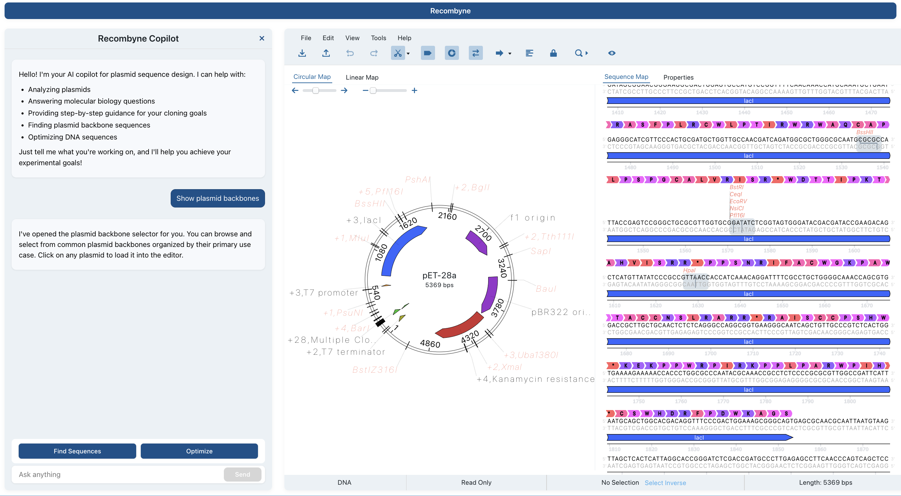

# Recombyne - AI-Powered Plasmid Design Assistant



Recombyne is an advanced web-based plasmid design application that combines the power of AI with intuitive DNA sequence visualization. It serves as a conversational interface for molecular biologists and genetic engineers to design custom plasmids through natural language interactions.

## Key Features

- **Conversational Interface**: Interact with the AI copilot using natural language to design and modify plasmids
- **Real-time Sequence Visualization**: Utilizes @teselagen/ove for interactive DNA sequence viewing and editing
- **Smart Backbone Selection**: Browse and insert pre-built plasmid backbones with category-based organization
- **GenBank Integration**: Search and import sequences directly from NCBI GenBank
- **Context-Aware AI**: Maintains conversation history for consistent and accurate assistance
- **Modern UI**: Clean, responsive design with intuitive split-pane layout

## How It Works

Recombyne acts as a "cursor" for plasmid design by:

1. Understanding user intent through natural language processing
2. Providing context-aware suggestions and modifications
3. Visualizing changes in real-time with interactive sequence views
4. Maintaining conversation history for consistent guidance
5. Integrating with external databases for comprehensive sequence information

## Acknowledgments

This project leverages several powerful open-source tools:

- **@teselagen/ove**: For advanced DNA sequence visualization and editing capabilities
- **DNAChisel**: For sequence optimization and design functionality

We are grateful to the maintainers and contributors of these projects for making this application possible.

## Getting Started

### Prerequisites

- Node.js (v18 or higher)
- npm or yarn package manager
- OpenAI API key (for AI functionality)
- NCBI API key (for GenBank integration)

### Installation

1. Clone the repository:
```bash
git clone https://github.com/yourusername/recombyne.git
cd recombyne-18
```

2. Install dependencies:
```bash
npm install
# or
yarn install
```

3. Set up environment variables:
Copy the `.env.example` file to `.env` in the root directory and update the values:
```bash
cp .env.example .env
```

4. Build the application:
- To build only the frontend:
  ```bash
  npm run build:frontend
  ```
- To build only the backend:
  ```bash
  npm run build:backend
  ```

5. Start the servers:
- To start the backend server:
  ```bash
  npm run start:backend
  ```
- To start the frontend (development mode):
  ```bash
  npm start
  # or
  yarn start
  ```

The application will be available at:
- Frontend: http://localhost:3000 (or the next available port, e.g., 3010)
- Backend API: http://localhost:3001 (or as set in your .env)

**Note:** If ports 3000/3001 are in use, Vite and the backend will select the next available port and display it in the terminal.
### Environment Variables

The application requires several environment variables to function properly. Here's what each variable is used for:

- **Server Configuration**
  - `SERVER_PORT`: Port for the Express server (default: 3001)
  - `PYTHONPATH`: Path to Python executable for DNA optimization (default: /usr/local/bin/python3)

- **OpenAI Configuration**
  - `REACT_APP_OPENAI_API_KEY`: Your OpenAI API key for AI features
    - Get your key from: https://platform.openai.com/api-keys

- **NCBI Configuration**
  - `REACT_APP_NCBI_EMAIL`: Your email for NCBI API requests
  - `REACT_APP_NCBI_TOOL_NAME`: Name of your tool for NCBI API (default: recombyne-plasmid-editor)
  - `REACT_APP_NCBI_API_KEY`: Your NCBI API key for enhanced access
    - Get your key from: https://ncbiinsights.ncbi.nlm.nih.gov/2017/11/02/new-api-keys-for-the-e-utilities/

- **Development Configuration**
  - `REACT_APP_USE_MOCK_API`: Set to false for production

### Development Server

The application uses a dual-server setup:
- **Frontend**: Vite development server (default port 3000, but will increment if busy)
- **Backend**: Express server (default port 3001, configurable via `.env`)

You can start each server independently using the scripts above. This modular approach allows you to work on frontend or backend in isolation, or both together.
### Troubleshooting

1. If you encounter dependency conflicts during installation, you can try:
```bash
npm install --legacy-peer-deps
```

2. If the application fails to start, check:
   - All required environment variables are set correctly
   - Ports 3000 and 3001 (or your specified ports) are not in use
   - You have the correct Node.js version installed

3. If the backend server fails to start or DNA optimization fails:
   - Ensure Python 3 and all required Python dependencies (see `src/server/python/requirements.txt`) are installed:
     ```bash
     pip install -r src/server/python/requirements.txt
     ```
   - Check for errors in the backend server terminal for Python or API issues.

4. For NCBI API issues:
   - Ensure your NCBI API key is valid
   - Check your email is correctly set
   - Verify your tool name is properly configured

5. For OpenAI API issues:
   - Verify your API key is valid and has sufficient credits
   - Check your network connection to OpenAI's servers

### Stopping the Application

To stop the application, press `Ctrl+C` in the terminal. This will gracefully shut down both the frontend and backend servers.