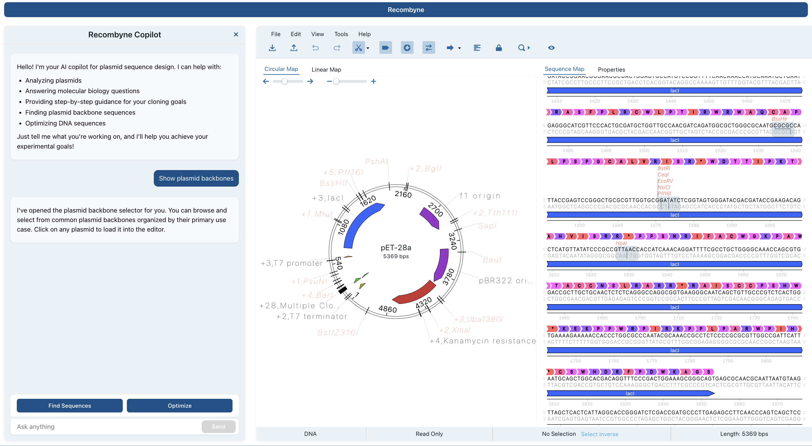

# Recombyne - AI-Powered Plasmid Design Assistant



Recombyne is an advanced web-based plasmid design application that combines the power of AI with intuitive DNA sequence visualization. It serves as a conversational interface for molecular biologists and genetic engineers to design custom plasmids through natural language interactions.

## Key Features

- **Conversational Interface**: Interact with the AI copilot using natural language to design and modify plasmids
- **Real-time Sequence Visualization**: Utilizes @teselagen/ove for interactive DNA sequence viewing and editing
- **Smart Backbone Selection**: Browse and insert pre-built plasmid backbones with category-based organization
- **GenBank Integration**: Search and import sequences directly from NCBI GenBank
- **DNA Optimization**: Optimize sequences using DNAChisel for GC content, codon usage, and more
- **Context-Aware AI**: Maintains conversation history for consistent and accurate assistance
- **Modern UI**: Clean, responsive design with intuitive split-pane layout

## How It Works

Recombyne acts as a "cursor" for plasmid design by:

1. Understanding user intent through natural language processing
2. Providing context-aware suggestions and modifications
3. Visualizing changes in real-time with interactive sequence views
4. Maintaining conversation history for consistent guidance
5. Integrating with external databases for comprehensive sequence information

## Acknowledgments

This project leverages several powerful open-source tools:

- **@teselagen/ove**: For advanced DNA sequence visualization and editing capabilities
- **DNAChisel**: For sequence optimization and design functionality

We are grateful to the maintainers and contributors of these projects for making this application possible.

## Getting Started

### Prerequisites

- Node.js (v18 or higher)
- npm or yarn package manager
- Python 3.x
- OpenAI API key (for AI functionality)
- NCBI API key (for GenBank integration)

### Installation

1. Clone the repository:
```bash
git clone https://github.com/yourusername/recombyne.git
cd recombyne
```

2. Install Node.js dependencies:
```bash
npm install
# or
yarn install
```

3. Install Python dependencies (required for DNA optimization):
```bash
# Install DNAChisel with reports functionality
pip3 install "dnachisel[reports]"
```

4. Set up environment variables:
   - Copy the `.env.example` file to `.env`:
   ```bash
   cp .env.example .env
   ```
   - Find your Python path:
   ```bash
   which python3
   ```
   - Update the `.env` file with:
     - Your Python path (PYTHONPATH)
     - Your OpenAI API key
     - Your NCBI credentials

5. Start the development server:
```bash
npm run dev
# or
yarn dev
```

The application will be available at:
- Frontend: http://localhost:3000
- Backend API: http://localhost:3001

### DNA Optimization Setup

The DNA optimization feature requires proper setup of Python and DNAChisel:

1. **Python Setup**:
   - Ensure Python 3.x is installed on your system
   - Find your Python path using `which python3` (Unix/Mac) or `where python3` (Windows)
   - Update the `PYTHONPATH` in your `.env` file with the correct path

2. **DNAChisel Installation**:
   ```bash
   # Install with all optimization features
   pip3 install "dnachisel[reports]"
   ```

3. **Verify Installation**:
   ```bash
   # Run the test script to verify DNA optimization works
   python3 src/server/python/test_optimization.py
   ```

4. **Common Issues**:
   - If you see "Python path: Not set" in the server logs but optimization still works, this is normal
   - If optimization fails, verify:
     - DNAChisel is installed correctly
     - Python path in `.env` is correct
     - The sequence length is valid (must be divisible by 3 for codon optimization)

### Environment Variables

The application requires several environment variables to function properly. Here's what each variable is used for:

- **Server Configuration**
  - `SERVER_PORT`: Port for the Express server (default: 3001)
  - `PYTHONPATH`: Path to Python executable for DNA optimization
    - Find using `which python3` (Unix/Mac) or `where python3` (Windows)
    - Must point to a Python installation with DNAChisel installed

- **OpenAI Configuration**
  - `REACT_APP_OPENAI_API_KEY`: Your OpenAI API key for AI features
    - Get your key from: https://platform.openai.com/api-keys

- **NCBI Configuration**
  - `REACT_APP_NCBI_EMAIL`: Your email for NCBI API requests
  - `REACT_APP_NCBI_TOOL_NAME`: Name of your tool for NCBI API (default: recombyne-plasmid-editor)
  - `REACT_APP_NCBI_API_KEY`: Your NCBI API key for enhanced access
    - Get your key from: https://ncbiinsights.ncbi.nlm.nih.gov/2017/11/02/new-api-keys-for-the-e-utilities/

- **Development Configuration**
  - `REACT_APP_USE_MOCK_API`: Set to false for production

### Development Server

The application uses a dual-server setup:
- Frontend: Vite development server (port 3000)
- Backend: Express server (port 3001)

Both servers run concurrently using the `concurrently` package. The `npm run dev` command starts both servers simultaneously.

### Troubleshooting

1. If you encounter dependency conflicts during installation, you can try:
```bash
npm install --legacy-peer-deps
```

2. If the application fails to start, check:
   - All required environment variables are set correctly
   - Ports 3000 and 3001 are not in use by other applications
   - You have the correct Node.js version installed

3. For DNA optimization issues:
   - Verify Python path is correct in `.env`
   - Ensure DNAChisel is installed: `pip3 install "dnachisel[reports]"`
   - Run the test script: `python3 src/server/python/test_optimization.py`
   - Check sequence length is valid for optimization

4. For NCBI API issues:
   - Ensure your NCBI API key is valid
   - Check your email is correctly set
   - Verify your tool name is properly configured

5. For OpenAI API issues:
   - Verify your API key is valid and has sufficient credits
   - Check your network connection to OpenAI's servers

### Stopping the Application

To stop the application, press `Ctrl+C` in the terminal. This will gracefully shut down both the frontend and backend servers.